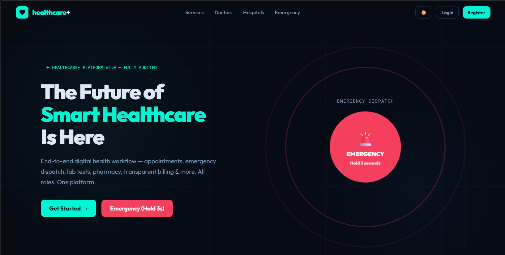

# Sunny Gautam - Personal Portfolio

 <!-- Update with an actual preview image of your portfolio if you have one -->

A modern, responsive personal portfolio website built with **React**, **Vite**, and **Tailwind CSS / Custom CSS**. This portfolio showcases my projects, skills, experience, and achievements as a Software Developer.

## 🚀 Live Demo
*(Add your live URL here once deployed, e.g., Vercel, Netlify, or GitHub Pages)*

## ✨ Features
- **Modern UI/UX**: Clean, responsive, and dynamic design.
- **Projects Showcase**: Highlights key projects like Healthcare+ Platform, Crop Disease Prediction System, and more.
- **Skills Section**: Visual representation of technical proficiencies.
- **Experience Timeline**: Academic and professional journey.
- **Contact Form**: Integrated with EmailJS for seamless communication.
- **Resume Download**: Easily accessible CV for recruiters.

## 🛠️ Tech Stack
- **Frontend**: React (v19), React Router DOM
- **Build Tool**: Vite
- **Styling**: CSS / HTML5
- **Services**: EmailJS (for contact form)

## 💻 Getting Started

Follow these instructions to set up the project locally.

### Prerequisites
- Node.js (v18 or higher)
- npm or yarn

### Installation

1. **Clone the repository:**
   ```bash
   git clone https://github.com/SGhubatgit/portfolio.git
   cd portfolio
   ```

2. **Install dependencies:**
   ```bash
   npm install
   ```

3. **Set up EmailJS (for the contact form):**
   - Create an account at [EmailJS](https://www.emailjs.com/).
   - Update `src/data/resume.js` with your specific `SERVICE_ID`, `TEMPLATE_ID`, and `PUBLIC_KEY`.

4. **Run the development server:**
   ```bash
   npm run dev
   ```
   Open `http://localhost:5173` to view the app in your browser.

## 📂 Project Structure
Key data for the portfolio is centrally managed. You can easily update your profile, projects, and skills by modifying:
- `src/data/resume.js`: Contains all text, links, projects, and skills data used across the application.

## 📬 Contact
- **Email**: sunnygautam@example.com
- **LinkedIn**: [Sunny Gautam](https://www.linkedin.com/in/sunny-gautam-3b830031b/)
- **GitHub**: [@SGhubatgit](https://github.com/SGhubatgit)
